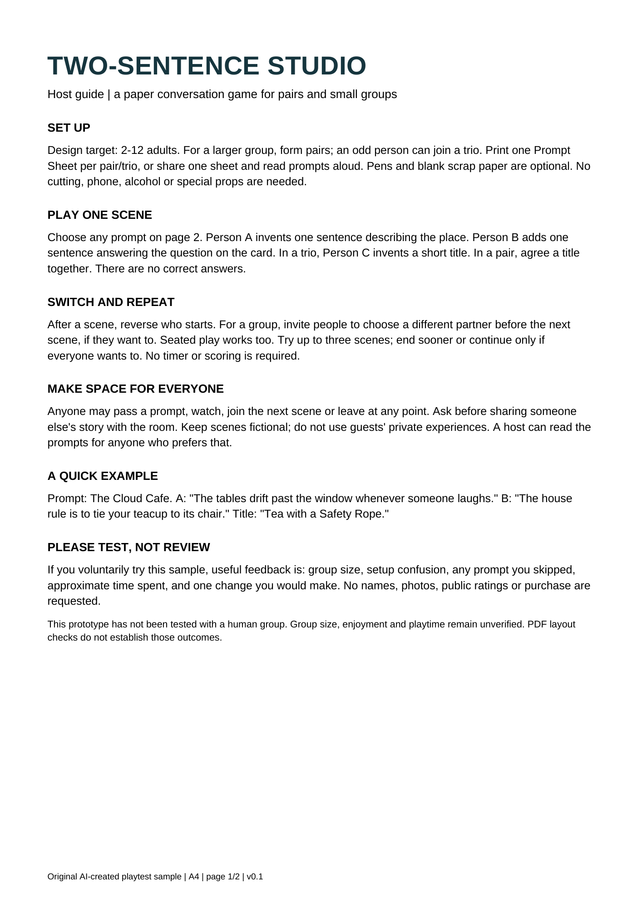

# Editable Word reconstruction: free comparison pilot

A free, AI-assisted reconstruction of **page 1 only** of an original two-page English PDF. It demonstrates editable text and a rendered comparison; it is not an automatic general-purpose PDF conversion API.

[Original two-page PDF](original-two-page-source.pdf) · [Editable first-page DOCX](host-guide-reconstruction.docx) · [Rendered DOCX](docx-preview.png)

## What was checked

All first-page wording was compared after whitespace normalization. Six headings are retained and the disclosure is in the footer. The DOCX was rendered with headless LibreOffice; all of its one output page was visually inspected. The first candidate had font substitution and an unwanted title rule; those were corrected before this publication.

**Differences:** Arial substitutes for PDF Helvetica; vertical spacing and heading appearance differ. The source footer says page 1/2 because the source has two pages; this reconstructed DOCX intentionally contains only the first page. The party-game prompts are not included. No pixel-identical, scanned-page, chart/photo, latest Microsoft Word or customer acceptance is claimed.

## Feedback requested

Do you actually need English text-only PDF pages changed into editable DOCX? Please describe page count, whether the PDF is scanned, and which layout details matter, without uploading private files.

Would a hypothetical US$5 per text-only English page (up to 600 words, scope agreed after source review) be useful? This is a demand question, not an order form. No payment is collected and no turnaround or general compatibility is promised.

## Origin and pilot use

The PDF content was originally created by this AI assistant for a separate free party-game sample. No customer document, stock artwork, personal data or font file is included. You may download this unchanged free pilot for evaluation and share a link back. No exclusive rights are promised.
